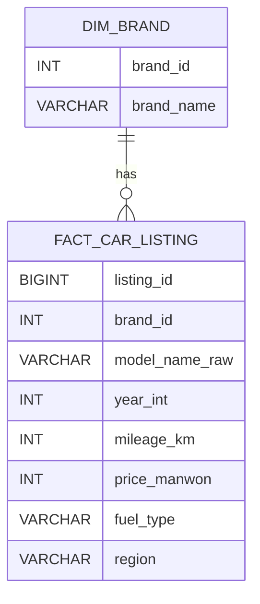

# 🚗 데이터 기반 중고차 구매 의사결정 지원 서비스

중고차 구매자가 선택한 차량의 가격 합리성을 시장 데이터 기반으로 검증하고,  
더 나은 대안을 함께 제시하는 **구매 의사결정 지원 데이터 서비스**입니다.

---

# 📌 목차

- 프로젝트 개요
- 핵심 기능
- 시장 문제 정의
- 시스템 아키텍처
- 데이터베이스 구조
- 데이터 파이프라인
- 분석 로직 설계
- 가격 적정도 모델
- 추천 탐색 모델
- 서비스 UI
- 프로젝트 차별점
- 기대 효과 및 발전 방향
- 팀 구성

---

# 1️⃣ 프로젝트 개요

## 한 줄 요약
> 사용자가 선택한 중고차의 가격이 시장 대비 합리적인지 분석하고,  
> 더 나은 선택 가능성까지 제시하는 데이터 기반 의사결정 지원 서비스

---

## 기획 배경

중고차 구매자는 다음과 같은 불안을 가진다.

- 시장 대비 가격이 비싼지 여부
- 동일 조건 대비 더 나은 선택 존재 여부
- 구매 후 후회 가능성

기존 플랫폼은 단순 조회 기능만 제공하며  
구매 판단을 돕는 해석 정보를 제공하지 않는다.

---

## 프로젝트 목표

- 가격 적정성 분석
- 기대가격 산출
- 유사 차량 비교
- 대안 차량 추천
- 의사결정 요약 제공

---

# 2️⃣ 핵심 기능

| 구분 | 기능 | 설명 |
|------|------|------|
| 가격 분석 | 가격 적정도 판단 | 기대가격 대비 위치 분석 |
| 군집 분석 | 유사 매물 탐색 | 연식/주행거리 기반 |
| 시각화 | 가격 분포 | 히스토그램 |
| 추천 | 가성비 차량 탐색 | 환산주행 기반 |
| UI | 의사결정 요약 | 카드 형태 |

---

# 3️⃣ 시장 문제 정의

기존 중고차 플랫폼:

- 가격순 정렬
- 연식순 정렬
- 주행거리순 정렬

→ 해석 정보 부재

본 서비스:

- 가격 위치 해석
- 시장 분포 비교
- 대안 탐색

---

# 4️⃣ 시스템 아키텍처

```
Crawler → MySQL → Python Analysis → Streamlit
```

---

# 5️⃣ 데이터베이스 구조



---

# 6️⃣ 데이터 파이프라인

```
웹 크롤링
 → Raw 저장
 → 정규화
 → 분석 데이터셋 생성
 → 유사도 군집
 → 가격 모델링
 → 시각화
```

---

# 7️⃣ 분석 로직 설계

## 유사도 군집

동일 모델 기준:

- 연식 차이
- 주행거리 차이

---

## 가중치 근거

연식 1년 ≈ 22,000km

선행연구 기반 감가 효과 반영.

---

## 유사도 함수

```
similarity = exp(-distance)
```

---

# 8️⃣ 기대가격 모델

군집 내 회귀 분석:

```
Price = β0 + β1·Year + β2·Mileage
```

---

# 9️⃣ 가격 적정도 판단

```
가격차이 = 실제 − 기대
```

| 구간 | 의미 |
|------|------|
| Q1 이하 | 저렴 |
| Q1~Q3 | 적정 |
| Q3 이상 | 비쌈 |

---

# 🔟 시각화

- 가격차이 히스토그램
- 구간 색상 표시
- 내 차량 위치
- 중앙값 표시

---

# 1️⃣1️⃣ 추천 탐색 모델

## 환산주행거리

```
연식 × 22,000 + 주행거리
```

## 가성비 점수

- 가격 점수
- 상태 점수
- 평균 산출

---

# 1️⃣2️⃣ 서비스 UI

## 메인

- 차량 선택 여부 분기

## 가격 적정도 분석

- 입력
- 카드 요약
- 히스토그램

## 추천 탐색

- 조건 필터
- TOP 추천
- 분포 산점도

---

# 1️⃣3️⃣ 프로젝트 차별점

- 의사결정 중심 서비스
- 설명 가능한 분석
- 머신러닝 없이 구현
- 시장 감가 반영 유사도

---

# 1️⃣4️⃣ 기대 효과 및 발전 방향

## 기대 효과

- 구매 판단 시간 단축
- 가격 협상 근거 제공
- 후회 가능성 감소

## 발전 방향

- 옵션 반영
- 지역 반영
- 딥러닝 가격모델 확장

---

# 1️⃣5️⃣ 팀 구성

| 이름 | 역할 |
|------|------|
| 팀원1 | 데이터 수집 |
| 팀원2 | DB 설계 |
| 팀원3 | 분석 |
| 팀원4 | 서비스 구현 |

---

# 📌 최종 요약

> 차량 구매자의 실제 고민에서 출발해  
> 데이터를 통해 가격과 선택의 합리성을 설명하는  
> 중고차 구매 의사결정 지원 데이터 서비스
